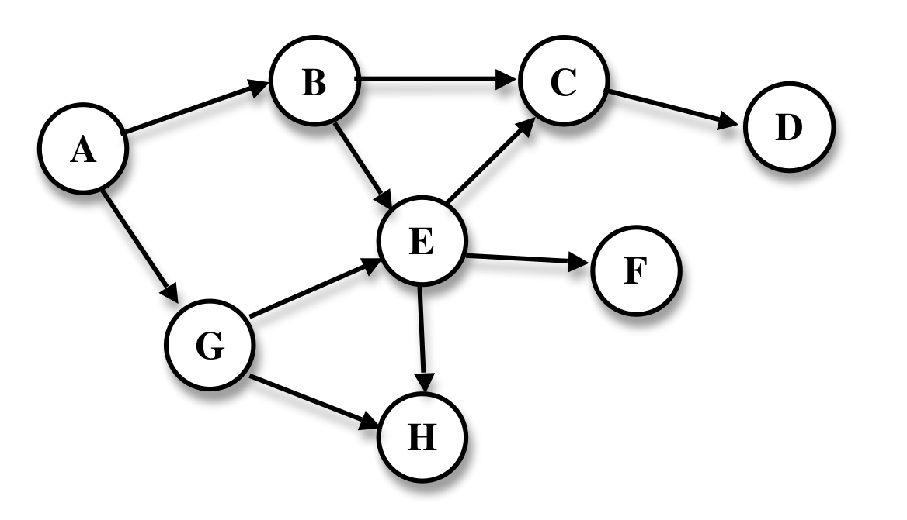

## Question 6
> The structure shown below is a directed acyclic graph with eight vertices.
> 
>
***
**(Q6.a)** 10 Marks
> Show how an _**adjacency matrix**_ can be used to represent the relationships between the edges and vertices in the graph.

In graph theory and computer science, an **adjacency matrix** is a square matrix used to represent a finite graph. The elements of the matrix indicate whether pairs of vertices are adjacent or not in the graph. ([wiki](https://en.wikipedia.org/wiki/Adjacency_matrix))

| **-** | A | B | C | D | E | F | G | H |
|-------|---|---|---|---|---|---|---|---|
| **A** |   | x |   |   |   |   | x |   |
| **B** |   |   | x |   | x |   |   |   |
| **C** |   |   |   | x |   |   |   |   |
| **D** |   |   |   |   |   |   |   |   |
| **E** |   |   | x |   |   | x |   | x |
| **F** |   |   |   |   |   |   |   |   |
| **G** |   |   |   |   | x |   |   | x |
| **H** |   |   |   |   |   |   |   |   |

***
**(Q6.b)** 15 Marks
> Using either pseudocode or Java, describe how a queue can be used to implement a _**breadth-first transversal**_ of the graph, starting at vertex “A”. You should also include a _**set of diagrams**_ showing the progress of the search through the graph.

```java
/**
* Breadth first transversal.
* Note: even if it looks like Java it is still a pseudo code
*/
static getSinkNodes(Node startNode){
    List<Node> sinkNodes;
    Queue<Node> q;
    Node node;

    q.offer(startNode);          // add surce node to queue

    while( q.peek() != null ){                      // while queue has node
        node = queue.poll();                        // take node from a queue

        if( node.getChildreans().size() == 0 ){     // if sink node ...
            sinkNodes.add(node);                    // ... add it to list.
        }else{
            node.getChildreans().stream()           // get node's childrens
                    .filter(Node::Unvisited)        // keep only unvisited nodes
                    .map(Node::markAsVizited)
                    .forEach(it -> q.offer(it));    // add them to the queue
        }
    }

    return sinkNodes;
}
```

#### diagram

| Queue   | Node | Children | Sink Nodes |
| ------- | ---- | -------- | ---------- |
| A       | A    | B, G     |            |
| B, G    | B    | C, E     |            |
| G, C, E | G    | (E), H   |            |
| C, E, H | C    | D        |            |
| E, H, D | E    | F, (H)   |            |
| H, D, F | H    |          | H          |
| D, F    | D    |          | H, D       |
| F       | F    |          | H, D, F    |
